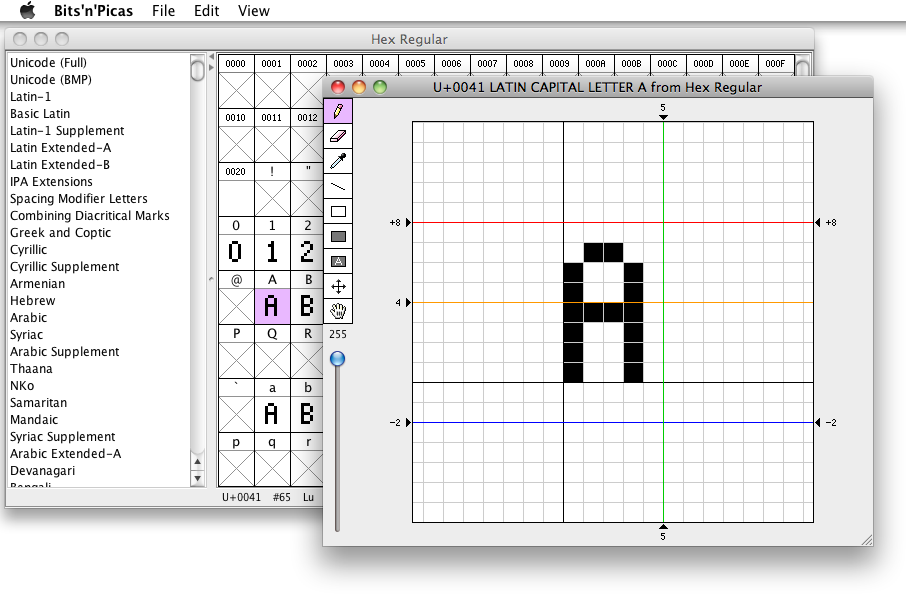
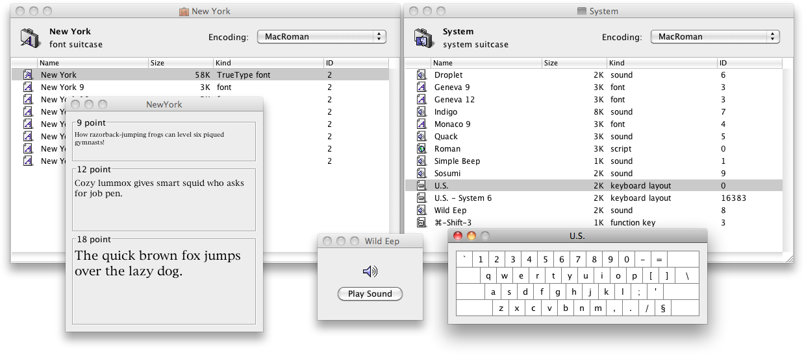
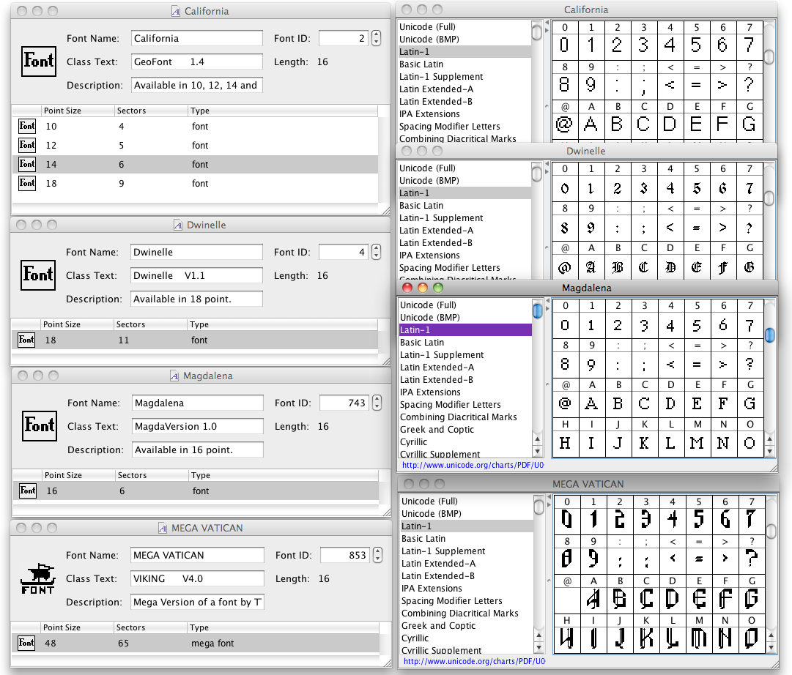

# Bits'N'Picas

Bits'N'Picas is a set of tools for creating and converting bitmap and emoji fonts.

Bitmap font functions can be accessed both with a GUI and from a command line. Emoji font functions can only be accessed from a command line.

## Creating and Editing Bitmap Fonts with a GUI

Launch the Bits'N'Picas JAR without any arguments or with the `edit` command to open the bitmap font editor GUI.

`java -jar BitsNPicas.jar`

`java -jar BitsNPicas.jar edit`

`java -jar BitsNPicas.jar edit myfont.sfd`

The input format is determined by the file extension of the input file. Supported input formats include:
  *  `.kbitx` - Bits'N'Picas 2.x native save format
  *  `.kbits` - Bits'N'Picas 1.x native save format
  *  `.sfd` - FontForge (bitmaps only; outlines not supported)
  *  `.bdf` - X11 Bitmap Distribution Format
  *  `.psf`, `.psfu`, `.psf.gz`, `.psfu.gz` - PC Screen Font
  *  `.suit` - Mac OS Classic font suitcase (in the resource fork)
  *  `.dfont` - Mac OS Classic font suitcase (in the data fork)
  *  `.nfnt` - Mac OS Classic font resource (in the data fork)
  *  `.png` - SFont or RFont, Kreative Software's extension of SFont
  *  `.png`, `.jpg`, `.jpeg`, `.gif`, `.bmp` - Create from image (GUI only)
  *  `.bin`, `.rom` - Create from binary file (GUI only)
  *  `.hex` - [GNU Unifont](http://unifoundry.com/unifont/index.html) hex format
  *  `.cvt` - GEOS font in Convert format (including MEGA fonts)
  *  `.fzx` - [FZX by Andrew Owen (for ZX Spectrum)](https://faqwiki.zxnet.co.uk/wiki/FZX_format)
  *  `.u8m` - [U8/M (UTF-8 for Microcomputers)](https://github.com/kreativekorp/u8m)
  *  `.font` - Amiga bitmap font (black and white only; color not supported)
  *  `.fnt` - Windows `.fnt` format (not the same as `.fon`; vector fonts not supported)
  *  `.fnt`, `.ftx` - [IBM DOS/V FONTX2 format](http://elm-chan.org/docs/dosv/fontx_e.html)
  *  `.fnt`, `.mgf`, `.mpf` - MousePaint/MouseGraphics ToolKit font
  *  `.fnt`, `.rbf`, `.rb11`, `.rb12` - [Rockbox Font Format](https://www.rockbox.org/wiki/FontFormat)
  *  `.fnt`, `.fntz`, `.fnty`, `.cyf` - [Cybiko Font Format](https://web.archive.org/web/20010701031854/http://groups.yahoo.com/group/CybikoDev/files/Pazera/font.txt)
  *  `.fnt`, `.png` - Playdate Font Format
  *  `.set` - Apple II Hi-Res Character Generator character set
  *  `.hmzk` - [Mi Band 2 Font Format](https://github.com/Freeyourgadget/Gadgetbridge/wiki/Mi-Band-2-%28HMZK%29-Font-Format)
  *  `.dsf` - [DOSStart! by Daniel L. Nice](https://web.archive.org/web/20120209004900/http://www.icdc.com/~dnice/dosstart.html)
  *  `.sbf` - Sabriel Bitmap Font

On Mac OS X you can also launch or drop a font file onto the Bits'N'Picas application.



Bits'N'Picas can also open font, desk accessory, and system suitcases and move around fonts, desk accessories, scripts, keyboard layouts, and sounds, just like the Finder used to be able to do back in the good old days of System 7.



A similar interface also exists for GEOS fonts.



## Converting Bitmap Fonts

Example:

`java -jar BitsNPicas.jar convertbitmap -f ttf -o myfont.ttf myfont.sfd`

This will convert the bitmap strikes in the FontForge file `myfont.sfd` to outlines in a new TrueType font file `myfont.ttf`. If, for example, the bitmap strikes are 16 pixels in height, the generated outlines will perfectly match the pixel grid at a 16-point font size.

The input format is determined by the file extension of the input file. Supported input formats include:
  *  `.kbitx` - Bits'N'Picas 2.x native save format
  *  `.kbits` - Bits'N'Picas 1.x native save format
  *  `.sfd` - FontForge (bitmaps only; outlines not supported)
  *  `.bdf` - X11 Bitmap Distribution Format
  *  `.psf`, `.psfu`, `.psf.gz`, `.psfu.gz` - PC Screen Font
  *  `.suit` - Mac OS Classic font suitcase (in the resource fork)
  *  `.dfont` - Mac OS Classic font suitcase (in the data fork)
  *  `.nfnt` - Mac OS Classic font resource (in the data fork)
  *  `.png` - SFont or RFont, Kreative Software's extension of SFont
  *  `.hex` - [GNU Unifont](http://unifoundry.com/unifont/index.html) hex format
  *  `.cvt` - GEOS font in Convert format (including MEGA fonts)
  *  `.fzx` - [FZX by Andrew Owen (for ZX Spectrum)](https://faqwiki.zxnet.co.uk/wiki/FZX_format)
  *  `.u8m` - [U8/M (UTF-8 for Microcomputers)](https://github.com/kreativekorp/u8m)
  *  `.font` - Amiga bitmap font (black and white only; color not supported)
  *  `.fnt` - Windows `.fnt` format (not the same as `.fon`; vector fonts not supported)
  *  `.fnt`, `.ftx` - [IBM DOS/V FONTX2 format](http://elm-chan.org/docs/dosv/fontx_e.html)
  *  `.fnt`, `.mgf`, `.mpf` - MousePaint/MouseGraphics ToolKit font
  *  `.fnt`, `.rbf`, `.rb11`, `.rb12` - [Rockbox Font Format](https://www.rockbox.org/wiki/FontFormat)
  *  `.fnt`, `.fntz`, `.fnty`, `.cyf` - [Cybiko Font Format](https://web.archive.org/web/20010701031854/http://groups.yahoo.com/group/CybikoDev/files/Pazera/font.txt)
  *  `.fnt`, `.png` - Playdate Font Format
  *  `.set` - Apple II Hi-Res Character Generator character set
  *  `.hmzk` - [Mi Band 2 Font Format](https://github.com/Freeyourgadget/Gadgetbridge/wiki/Mi-Band-2-%28HMZK%29-Font-Format)
  *  `.dsf` - [DOSStart! by Daniel L. Nice](https://web.archive.org/web/20120209004900/http://www.icdc.com/~dnice/dosstart.html)
  *  `.sbf` - Sabriel Bitmap Font

The output format is determined by the `-f` option. Supported output formats include:
  *  `kbitx` or `kbnp2` - Bits'N'Picas 2.x native save format
  *  `kbits` or `kbnp1` - Bits'N'Picas 1.x native save format
  *  `ttf` or `truetype` - TrueType
  *  `otb` - OpenType Bitmap
  *  `bdf` - X11 Bitmap Distribution Format
  *  `psf`, `psf2`, `psf1`, `psfgz`, `psf2gz`, `psf1gz` - PC Screen Font
  *  `suit` - Mac OS Classic font suitcase (in the resource fork)
  *  `dfont` - Mac OS Classic font suitcase (in the data fork)
  *  `nfnt` - Mac OS Classic font resource (in the data fork)
  *  `png` or `sfont` - SDL SFont
  *  `rfont` - RFont, Kreative Software's extension of SFont
  *  `hex` - [GNU Unifont](http://unifoundry.com/unifont/index.html) hex format
  *  `cvt` or `geos` - GEOS font in Convert format (with MEGA option)
  *  `fzx` - [FZX by Andrew Owen (for ZX Spectrum)](https://faqwiki.zxnet.co.uk/wiki/FZX_format)
  *  `u8m` - [U8/M (UTF-8 for Microcomputers)](https://github.com/kreativekorp/u8m)
  *  `font` or `amiga` - Amiga bitmap font (black and white only; color not supported)
  *  `fnt` or `fnt3` - Windows 3.x `.fnt` format (not the same as `.fon`)
  *  `fnt2` - Windows 2.x `.fnt` format (also not the same as `.fon`)
  *  `fontx2`, `fontx`, or `dosv` - [IBM DOS/V FONTX2 format](http://elm-chan.org/docs/dosv/fontx_e.html)
  *  `mgtk`, `mgf`, `mpf`, or `mousepaint` - MousePaint/MouseGraphics ToolKit font
  *  `rb12` - [Rockbox Font Format](https://www.rockbox.org/wiki/FontFormat) for Rockbox 2.3 or above
  *  `rb11` - [Rockbox Font Format](https://www.rockbox.org/wiki/FontFormat) for Rockbox 2.2 or below and iPodLinux
  *  `cybiko` - [Cybiko Font Format](https://web.archive.org/web/20010701031854/http://groups.yahoo.com/group/CybikoDev/files/Pazera/font.txt)
  *  `playdate`, `playdate-allinone`, `playdate-fnt` - Playdate font format, all-in-one (single .fnt file)
  *  `playdate-separate`, `playdate-fnt+png` - Playdate font format, separate .fnt and .png files
  *  `hrcg` or `set` - Apple II Hi-Res Character Generator character set
  *  `hmzk` - [Mi Band 2 Font Format](https://github.com/Freeyourgadget/Gadgetbridge/wiki/Mi-Band-2-%28HMZK%29-Font-Format)
  *  `sbf` - Sabriel Bitmap Font

Additional options include:
  *  `-s` *regex* `-r` *replacement* - Perform a search-and-replace on the font name.
  *  `-b` - Apply a faux-bold effect.
  *  `-w` *units* `-h` *units* - Specify the width and height of pixels in em units (for `ttf` format).
  *  `-i` *fontid* `-z` *size* - Specify the font ID and font size (for `nfnt` or `geos` format).

You can see a list of all options using the `--help` option.

## Extracting Images from Emoji/Color Fonts

### Example using Apple's `sbix` format

`java -jar BitsNPicas.jar extractsbix AppleColorEmoji.ttf`

This will extract the images from `AppleColorEmoji.ttf` into the directory `AppleColorEmoji.ttf.sbix.d` as PNG files. There will be several numbered subdirectories within this directory; the number corresponds to the *pixels per em* of the images within. (This is not necessarily the same thing as the image height!) The resulting directory structure will look like:

```
  AppleColorEmoji.ttf
  AppleColorEmoji.ttf.sbix.d
      20
          glyph_43.png
          glyph_44.png
          ...
      32
          glyph_43.png
          glyph_44.png
          ...
      ...
```

### Example using Adobe and Mozilla's SVG-in-OpenType format

`java -jar BitsNPicas.jar extractsvg EmojiOne.otf`

This will extract the SVG images from `EmojiOne.otf` into the directory `EmojiOne.otf.svg.d` as uncompressed SVG files. (If the SVG data inside the font is compressed, it will be decompressed.) The resulting directory structure will look like:

```
  EmojiOne.otf
  EmojiOne.otf.svg.d
      glyph_2.svg
      glyph_3.svg
      ...
```

### Example using Google's `CBDT`/`CBLC` format

`java -jar BitsNPicas.jar extractcbdt NotoColorEmoji.ttf`

This will extract the PNG images from `NotoColorEmoji.ttf` into the directory `NotoColorEmoji.ttf.cbdt.d`. There will be one or more numbered subdirectories within this directory; the number is simply the index of the BitmapSize record and has no other significance. The resulting directory structure will look like:

```
  NotoColorEmoji.ttf
  NotoColorEmoji.ttf.cbdt.d
      0000
          glyph_4.png
          glyph_5.png
          ....
          metadata.txt
      ....
      fontinfo.txt
```

The `metadata.txt` file within each subdirectory lists all the values from the various data structures within the `CBLC` and `CBDT` tables. The `fontinfo.txt` file just lists some other values from other, unrelated tables for convenience (since many font editors cannot open fonts with `CBDT`/`CBLC` tables for you to find these values due to the lack of `glyf`/`loca` tables).

### Microsoft's `COLR`/`CPAL` format

Microsoft's `COLR`/`CPAL` format is currently not supported.

## Injecting Images into Fonts to Create Emoji/Color Fonts

To create an emoji/color font, you will need two things:
  *  A plain black-and-white TrueType font into which you intend to inject the color images.
  *  The accompanying directory of images, in the same structure and format as generated by the extraction process above.

### Example using Apple's `sbix` format

`java -jar BitsNPicas.jar injectsbix MyEmoji.ttf`

This will take the TrueType font file `MyEmoji.ttf` and the images in the directory `MyEmoji.ttf.sbix.d` and generate a new TrueType font file `MyEmoji.ttf.sbix.ttf` with images embedded in an `sbix` table. You can then rename this file if you like. The name of each subdirectory within the image directory must be the *pixels per em* of the images it contains. (This is not necessarily the same thing as the image height!) The file name of each image within each subdirectory must be of the form `glyph_123.png` (with the glyph index in decimal) or `char_ABCD.png` (with the Unicode code point in hexadecimal). The bottom left position of each image will be determined by the minimum X and Y coordinates of the corresponding glyph in the TrueType font file. (For Apple Color Emoji, this just happens to be set to 0,0.)

### Example using Adobe and Mozilla's SVG-in-OpenType format

`java -jar BitsNPicas.jar injectsvg MyEmoji.otf`

This will take the OpenType font file `MyEmoji.otf` and the SVG images in the directory `MyEmoji.otf.svg.d` and generate a new OpenType font file `MyEmoji.otf.svg.otf` with images embedded in an `SVG ` table. You can then rename this file if you like. The file name of each image within the image directory must be of the form `glyph_123_456.svg` (for a range of glyphs, with the glyph indices in decimal), `glyph_123.svg` (for a single glyph, with the glyph index in decimal), or `char_ABCD.svg` (for a single glyph, with the Unicode code point in hexadecimal).

For each glyph index mapped to an SVG document, there must be an element in that document with an id corresponding to that glyph index (e.g. `id="glyph123"` for glyph index 123). Since you may not know the glyph index when specifying a code point in the image file name, you can use the placeholder `id="glyph{{{0}}}"` and it will be replaced with the appropriate glyph index during the injection process.

If you specify the `-z` option before the font file name, the SVG data will be compressed using GZIP. Microsoft claims the SVG-in-OpenType format supports this, and the availability of a version of EmojiOne with GZIP-compressed SVG glyphs appears to back this up. However, I was unable to get fonts with GZIP-compressed SVG glyphs to work even in the latest version of Firefox as of this writing, so I do not recommend this.

If you have a bunch of non-SVG images you would like to inject using this format, you can easily generate SVGs with embedded images using a command like the following:

`java -jar BitsNPicas.jar imagetosvg -x 0 -y -700 -w 800 -h 800 myimages/*.png`

This will create a corresponding SVG file for each non-SVG image file specified. The `-x`, `-y`, `-w`, `-h` options specify the position and size of the image in em units. Note that the SVG Y-axis is reversed from the TrueType Y-axis, so negative Y-coordinates are *above* the baseline and positive Y-coordinates are *below* the baseline.

### Example using Google's `CBDT`/`CBLC` format

`java -jar BitsNPicas.jar injectcbdt MyEmoji.ttf`

This will take the TrueType font file `MyEmoji.ttf` and the PNG images in the directory `MyEmoji.ttf.cbdt.d` and generate a new TrueType font file `MyEmoji.ttf.cbdt.ttf` with images embedded in a `CBDT` table. You can then rename this file if you like. There must be a subdirectory for each bitmap size; the names of the subdirectories do not matter. The file name of each image within each subdirectory must be of the form `glyph_123.png` (with the glyph index in decimal) or `char_ABCD.png` (with the Unicode code point in hexadecimal).

It is recommended for each subdirectory to also contain a `metadata.txt` file of values to use for the various data structures within the `CBLC` and `CBDT` tables. The following is recommended at a minimum:

```
  horiAscender: *ascent in pixels (normally positive)*
  horiDescender: *descent in pixels (normally negative)*
  horiWidthMax: *max character width in pixels*
  vertAscender: *ascent in pixels (normally positive)*
  vertDescender: *descent in pixels (normally negative)*
  vertWidthMax: *max character width in pixels*
  ppemX: *pixels per em*
  ppemY: *pixels per em*
  
  glyph: *glyph index*
  height: *image height in pixels*
  width: *image width in pixels*
  bearingX: *x offset in pixels*
  bearingY: *y offset in pixels (positive is above the baseline)*
  advance: *character width in pixels*
  endGlyph
```

For the glyph index you can also use `char_ABCD` (with the Unicode code point in hexadecimal) or `*` to cover all glyphs not otherwise specified. Fields associated with the data structure itself (various offsets, counts, and glyph index ranges, as well as anything associated with the various types of index subtables) do not need to be specified, will be ignored if specified, and will be calculated automatically. (Only index subtable format 1 and bitmap data formats 17, 18, and 19 will be used, regardless of the metadata specified.)

By default, `injectcbdt` will also remove any `glyf`, `loca`, `CFF `, or `CFF2` tables from the font. To keep these tables, specify the `-g` option before the font file name.

### Microsoft's `COLR`/`CPAL` format

Microsoft's `COLR`/`CPAL` format is currently not supported.


## 🌐 Web Resources & Aesthetic Symbols Index
- [SYM 1D431](https://ribbon-bow-unicode-18.pages.dev/symbol/sym-1d431/)
- [SYM 2657](https://mecha-gamer-fonts-53.pages.dev/symbol/sym-2657/)
- [SYM 2764 FE0F](https://clean-dot-aesthetic-48.pages.dev/symbol/sym-2764-fe0f/)
- [SYM 273E](https://vintage-lace-text-53.pages.dev/symbol/sym-273e/)
- [SYM 265A](https://aesthetic-spacing-fonts-10.pages.dev/symbol/sym-265a/)
- [SYM 1D447](https://pastel-chibi-emotes-23.pages.dev/symbol/sym-1d447/)
- [FREE FIRE CLAN EMPEROR CROWN](https://minimal-star-symbols-25.pages.dev/symbol/free-fire-clan-emperor-crown/)
- [SHADOWED WHITE STAR](https://angelic-ribbon-text-78.pages.dev/symbol/shadowed-white-star/)
- [SYM 1F499](https://cyber-clan-tags-23.pages.dev/symbol/sym-1f499/)
- [SYM 1F602](https://mecha-synth-kaomoji-92.pages.dev/symbol/sym-1f602/)
- [SYM 26A7](https://anime-sparkle-text-81.pages.dev/symbol/sym-26a7/)
- [BORDERS DIVIDERS](https://monochrome-text-lab-86.pages.dev/ru/borders-dividers/)
- [SYM 1D40D](https://scholarly-vintage-symbols-48.pages.dev/symbol/sym-1d40d/)
- [SYM 26DB](https://mecha-synth-kaomoji-92.pages.dev/symbol/sym-26db/)
- [SYM 2734](https://pearl-heart-symbols-95.pages.dev/symbol/sym-2734/)
- [SYM 1FAE3](https://anime-sparkle-text-81.pages.dev/symbol/sym-1fae3/)
- [SYM 26D4](https://kawaii-kaomoji-hub-93.pages.dev/symbol/sym-26d4/)
- [DISCORD STATUS](https://dark-literary-kaomoji-13.pages.dev/discord-status/)
- [SYM 1F498](https://witchy-runic-text-71.pages.dev/symbol/sym-1f498/)
- [SYM 26D2](https://gothic-bio-fonts-81.pages.dev/symbol/sym-26d2/)
- [SYM 1F60E](https://chibi-kaomoji-vault-58.pages.dev/symbol/sym-1f60e/)
- [SYM 2742](https://gothic-bio-fonts-86.pages.dev/symbol/sym-2742/)
- [INSTAGRAM BIO](https://matrix-glitch-text-37.pages.dev/ru/instagram-bio/)
- [SYM 1F916](https://cyber-clan-tags-75.pages.dev/symbol/sym-1f916/)
- [DISCORD STATUS](https://scholarly-vintage-symbols-48.pages.dev/discord-status/)
- [SYM 1F635](https://witchy-runic-text-71.pages.dev/symbol/sym-1f635/)
- [SYM 2748](https://sleek-arrow-symbols-42.pages.dev/symbol/sym-2748/)
- [LEO ZODIAC LION](https://witchy-runic-text-71.pages.dev/symbol/leo-zodiac-lion/)
- [SYM 26B2](https://gothic-bio-fonts-81.pages.dev/symbol/sym-26b2/)
- [SYM 1F634](https://fairy-lace-symbols-92.pages.dev/symbol/sym-1f634/)
- [CIRCLED STAR](https://sleek-bio-symbols-51.pages.dev/symbol/circled-star/)
- [SYM 1D454](https://gothic-bio-fonts-86.pages.dev/symbol/sym-1d454/)
- [TWELVE POINTED STAR](https://witchy-runic-text-71.pages.dev/symbol/twelve-pointed-star/)
- [SYM 1F63A](https://coquette-aesthetic-symbols-84.pages.dev/symbol/sym-1f63a/)
- [MUSIC WEATHER](https://minimal-star-symbols-43.pages.dev/music-weather/)
- [SYM 2613](https://anime-sparkle-text-81.pages.dev/symbol/sym-2613/)
- [SYM 1F61D](https://sleek-arrow-symbols-42.pages.dev/symbol/sym-1f61d/)
- [DISCORD STATUS](https://minimal-star-symbols-43.pages.dev/es/discord-status/)
- [RU](https://matrix-glitch-text-37.pages.dev/ru/)
- [SYM 2683](https://synthwave-text-vault-95.pages.dev/symbol/sym-2683/)
- [FLORAL HEART VINE](https://witchy-runic-text-71.pages.dev/symbol/floral-heart-vine/)
- [SYM 1F60A](https://witchy-runic-text-71.pages.dev/symbol/sym-1f60a/)
- [SYM 1D488](https://monochrome-text-lab-86.pages.dev/symbol/sym-1d488/)
- [SYM 26FD](https://synthwave-text-vault-95.pages.dev/symbol/sym-26fd/)
- [SYM 1D44A](https://gothic-bio-fonts-86.pages.dev/symbol/sym-1d44a/)
- [LEFT WHITE CORNER BRACKET](https://cyber-clan-tags-23.pages.dev/symbol/left-white-corner-bracket/)
- [SYM 268C](https://clean-aesthetic-fonts-73.pages.dev/symbol/sym-268c/)
- [SIX POINTED BLACK STAR](https://fairy-lace-symbols-92.pages.dev/symbol/six-pointed-black-star/)
- [SYM 1D402](https://occult-rune-symbols-64.pages.dev/symbol/sym-1d402/)
- [OUTLINED STAR](https://cyber-clan-tags-75.pages.dev/symbol/outlined-star/)
- [TELUGU RIBBON BOWLET](https://witchy-runic-text-71.pages.dev/symbol/telugu-ribbon-bowlet/)
- [SYM 1F608](https://sleek-bio-symbols-51.pages.dev/symbol/sym-1f608/)
- [FLORAL HEART VINE](https://scholarly-vintage-symbols-48.pages.dev/symbol/floral-heart-vine/)
- [SYM 1D414](https://anime-sparkle-text-81.pages.dev/symbol/sym-1d414/)
- [ROBLOX NAMES](https://matrix-glitch-text-37.pages.dev/ja/roblox-names/)
- [DISCORD STATUS](https://fairy-lace-symbols-92.pages.dev/pt/discord-status/)
- [LEFT RIGHT EXCHANGE ARROWS](https://sleek-arrow-symbols-42.pages.dev/symbol/left-right-exchange-arrows/)
- [LIBRA ZODIAC SCALES](https://witchy-runic-text-71.pages.dev/symbol/libra-zodiac-scales/)
- [TWELVE POINTED STAR](https://sleek-arrow-symbols-42.pages.dev/symbol/twelve-pointed-star/)
- [SYM 26C1](https://monochrome-text-lab-86.pages.dev/symbol/sym-26c1/)
- [SYM 1F634](https://witchy-runic-text-71.pages.dev/symbol/sym-1f634/)
- [SYM 1F63F](https://witchy-runic-text-71.pages.dev/symbol/sym-1f63f/)
- [SYM 1D49A](https://gothic-bio-fonts-81.pages.dev/symbol/sym-1d49a/)
- [SYM 1F623](https://cyber-clan-tags-75.pages.dev/symbol/sym-1f623/)
- [HEAVY RIGHTWARD ARROW](https://cyber-clan-tags-23.pages.dev/symbol/heavy-rightward-arrow/)
- [ARROWS LINES](https://scholarly-vintage-symbols-48.pages.dev/ja/arrows-lines/)
- [SYM 1D43F](https://chibi-kaomoji-vault-58.pages.dev/symbol/sym-1d43f/)
- [SYM 2667](https://coquette-aesthetic-symbols-84.pages.dev/symbol/sym-2667/)
- [SYM 2627](https://pearl-heart-symbols-95.pages.dev/symbol/sym-2627/)
- [SAGITTARIUS ZODIAC ARCHER](https://sleek-arrow-symbols-42.pages.dev/symbol/sagittarius-zodiac-archer/)
- [SYM 1D459](https://monochrome-text-lab-86.pages.dev/symbol/sym-1d459/)
- [LEFT WHITE CORNER BRACKET](https://minimal-star-symbols-25.pages.dev/symbol/left-white-corner-bracket/)
- [SYM 1F61F](https://witchy-runic-text-71.pages.dev/symbol/sym-1f61f/)
- [SYM 1D49B](https://cyber-clan-tags-75.pages.dev/symbol/sym-1d49b/)
- [SYM 2663](https://futuristic-gaming-fonts-52.pages.dev/symbol/sym-2663/)
- [SYM 2725](https://mecha-synth-kaomoji-92.pages.dev/symbol/sym-2725/)
- [SYM 1D49D](https://chibi-kaomoji-vault-58.pages.dev/symbol/sym-1d49d/)
- [SYM 1D442](https://anime-sparkle-text-81.pages.dev/symbol/sym-1d442/)
- [SYM 1F978](https://gothic-bio-fonts-86.pages.dev/symbol/sym-1f978/)
- [SYM 26B6](https://kawaii-kaomoji-hub-77.pages.dev/symbol/sym-26b6/)
- [SYM 1F49B](https://chibi-kaomoji-vault-58.pages.dev/symbol/sym-1f49b/)
- [SYM 260A](https://kawaii-kaomoji-hub-77.pages.dev/symbol/sym-260a/)
- [SYM 1D418](https://witchy-runic-text-71.pages.dev/symbol/sym-1d418/)
- [ARIES ZODIAC RAM](https://coquette-aesthetic-symbols-62.pages.dev/symbol/aries-zodiac-ram/)
- [SYM 1D479](https://chibi-kaomoji-vault-58.pages.dev/symbol/sym-1d479/)
- [SYM 267B](https://futuristic-gaming-fonts-52.pages.dev/symbol/sym-267b/)
- [ES](https://fairy-lace-symbols-92.pages.dev/es/)
- [SYM 1D431](https://anime-sparkle-text-81.pages.dev/symbol/sym-1d431/)
- [ZODIAC CELESTIAL](https://matrix-glitch-text-37.pages.dev/ru/zodiac-celestial/)
- [WINGED ANGELIC COQUETTE HEART](https://matrix-glitch-text-37.pages.dev/symbol/winged-angelic-coquette-heart/)
- [SYM 1D401](https://chibi-kaomoji-vault-58.pages.dev/symbol/sym-1d401/)
- [SYM 1D446](https://witchy-runic-text-71.pages.dev/symbol/sym-1d446/)
- [SYM 1F60D](https://anime-sparkle-text-81.pages.dev/symbol/sym-1f60d/)
- [SYM 274A](https://pearl-girly-fonts-86.pages.dev/symbol/sym-274a/)
- [SYM 1F616](https://vintage-library-rune-80.pages.dev/symbol/sym-1f616/)
- [SYM 1D429](https://synthwave-text-vault-95.pages.dev/symbol/sym-1d429/)
- [SYM 1D49F](https://mecha-blade-symbols-46.pages.dev/symbol/sym-1d49f/)
- [SYM 1D47B](https://chibi-kaomoji-vault-58.pages.dev/symbol/sym-1d47b/)
- [SYM 1F92F](https://pearl-heart-symbols-95.pages.dev/symbol/sym-1f92f/)
- [SYM 268C](https://sleek-bio-symbols-51.pages.dev/symbol/sym-268c/)
- [SHADOWED WHITE STAR](https://kawaii-kaomoji-hub-77.pages.dev/symbol/shadowed-white-star/)
- [SYM 1D409](https://sleek-arrow-symbols-42.pages.dev/symbol/sym-1d409/)
- [BORDERS DIVIDERS](https://pastel-chibi-emotes-23.pages.dev/borders-dividers/)
- [SYM 26CA](https://mecha-synth-kaomoji-92.pages.dev/symbol/sym-26ca/)
- [SYM 1D49F](https://scholarly-cross-symbols-35.pages.dev/symbol/sym-1d49f/)
- [SYM 1D41F](https://anime-sparkle-text-81.pages.dev/symbol/sym-1d41f/)
- [SYM 1D472](https://chibi-kaomoji-vault-58.pages.dev/symbol/sym-1d472/)
- [SYM 1F60E](https://pearl-heart-symbols-95.pages.dev/symbol/sym-1f60e/)
- [SYM 1D406](https://chibi-kaomoji-vault-58.pages.dev/symbol/sym-1d406/)
- [SYM 262B](https://chibi-kaomoji-vault-58.pages.dev/symbol/sym-262b/)
- [LEFT MATHEMATICAL WHITE SQUARE BRACKET](https://mecha-blade-symbols-46.pages.dev/symbol/left-mathematical-white-square-bracket/)
- [SYM 267F](https://synthwave-text-vault-95.pages.dev/symbol/sym-267f/)
- [LATIN CROSS FAITH](https://minimal-star-symbols-25.pages.dev/symbol/latin-cross-faith/)
- [TRENDING](https://mecha-blade-symbols-46.pages.dev/ru/trending/)
- [SYM 1D448](https://futuristic-gaming-fonts-52.pages.dev/symbol/sym-1d448/)
- [SYM 1D44A](https://witchy-runic-text-71.pages.dev/symbol/sym-1d44a/)
- [SYM 2613](https://sleek-bio-symbols-51.pages.dev/symbol/sym-2613/)
- [SYM 1D486](https://chibi-kaomoji-vault-58.pages.dev/symbol/sym-1d486/)
- [CYBER PHANTOM GLYPH](https://minimal-star-symbols-25.pages.dev/symbol/cyber-phantom-glyph/)
- [GAMING WEAPONS](https://baroque-font-vault-96.pages.dev/ja/gaming-weapons/)
- [GEMINI ZODIAC TWINS](https://fairy-lace-symbols-92.pages.dev/symbol/gemini-zodiac-twins/)
- [SYM 2764 FE0F 200D 1F525](https://synthwave-text-vault-95.pages.dev/symbol/sym-2764-fe0f-200d-1f525/)
- [SYM 2721](https://matrix-glitch-text-37.pages.dev/symbol/sym-2721/)
- [SYM 1F635 200D 1F4AB](https://witchy-runic-text-71.pages.dev/symbol/sym-1f635-200d-1f4ab/)
- [ANGEL WINGS HEART](https://cyber-clan-tags-23.pages.dev/symbol/angel-wings-heart/)
- [SYM 1D49A](https://scholarly-cross-symbols-35.pages.dev/symbol/sym-1d49a/)
- [SYM 1D429](https://anime-sparkle-text-81.pages.dev/symbol/sym-1d429/)
- [SYM 1F61F](https://clean-aesthetic-fonts-73.pages.dev/symbol/sym-1f61f/)
- [GEORGIAN LOVE HEART](https://fairy-lace-symbols-92.pages.dev/symbol/georgian-love-heart/)
- [ROBLOX NAMES](https://cyber-clan-tags-23.pages.dev/ru/roblox-names/)
